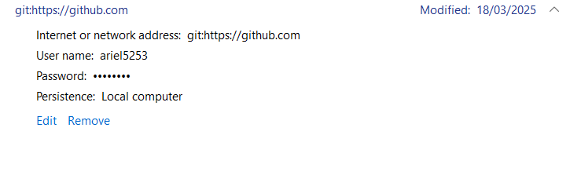

# 📘 Manual paso a paso para clonar, publicar y administrar un repositorio en GitHub

Este manual te guía desde cero en el uso de **Git** y **GitHub**, explicando cómo instalar, configurar, clonar, publicar y administrar un repositorio, con buenas prácticas y recursos útiles.

---

## 🔧 1. Tener Git instalado

Antes de comenzar, asegúrate de tener:
- Una cuenta en [GitHub](https://github.com/).
- **Git** instalado en tu computadora:
  - **Windows:** Descárgalo desde [git-scm.com](https://git-scm.com/).
  - **Linux:**
    ```bash
    sudo apt update && sudo apt install git -y
    ```
  - **MacOS:**
    ```bash
    brew install git
    ```
- Un editor de código como [Visual Studio Code](https://code.visualstudio.com/).

Verifica la instalación de git con:
```bash
git --version
```

---

## 👤 2. Configurar usuario en Git

Configura tu nombre y correo (el mismo que usas en GitHub):
```bash
git config --global user.name "Tu Nombre"
git config --global user.email "tu_correo@example.com"
```
Verifica la configuración:
```bash
git config --list
```

---

### 🔑 2.1. Credenciales y autenticación
- En Windows, puedes usar credenciales de Windows o autenticación de GitHub.
- Si usas un equipo público, cierra sesión y elimina credenciales.
- Para mayor seguridad, puedes usar llaves SSH ([Guía oficial](https://docs.github.com/es/authentication/connecting-to-github-with-ssh)).

*Ver credenciales del equipo:*



---

## 📂 3. Clonar un repositorio

Para copiar un repositorio de GitHub a tu computadora:
1. Copia la URL del repositorio (HTTPS o SSH).
2. Ejecuta el comando en la ruta donde quieres guardar el proyecto (ejemplo: `C:\www\corhuila`):
   ```bash
   git clone https://github.com/usuario/mi-proyecto.git
   ```
3. Entra al directorio:
   ```bash
   cd mi-proyecto
   ```

---

## 📥 4. Obtener cambios del repositorio remoto

Para actualizar tu copia local con los cambios de GitHub:
```bash
git pull
```
Si trabajas con ramas:
```bash
git pull origin nombre-rama
```

---

## ✍️ 5. Publicar cambios en GitHub

Para subir tus cambios al repositorio remoto:
1. Descarga primero los cambios remotos:
   ```bash
   git pull
   ```
2. Verifica el estado de los archivos:
   ```bash
   git status
   ```
3. Agrega los archivos modificados:
   ```bash
   git add .
   ```
4. Realiza un commit con un mensaje descriptivo (preferiblemente en inglés):
   ```bash
   git commit -m "Describe your change"
   ```
5. Sube los cambios:
   ```bash
   git push
   ```

---

## 🛠️ Buenas prácticas
- Haz commits pequeños y frecuentes.
- Usa mensajes claros y descriptivos.
- Sincroniza antes de trabajar (`git pull`).
- Usa ramas para nuevas funciones o correcciones.
- No subas información sensible (contraseñas, API keys).

---

## ✅ Resumen rápido de comandos
```bash
# Clonar un repositorio
git clone URL

# Ver estado de cambios
git status

# Agregar archivos
git add archivo.txt

# Guardar cambios
git commit -m "mensaje"

# Subir cambios
git push

# Descargar cambios
git pull
```